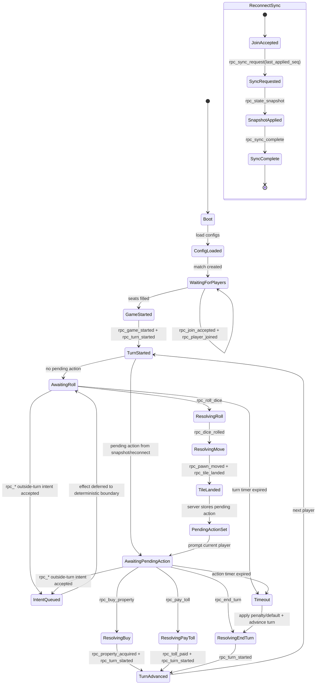

# Server State Machine (Headless)

This diagram is a high-level guide for prioritizing unit tests and RPCs. Each transition should map to at least one test.

Notes:
- "Pending action" is authoritative server state and gates which action RPCs are valid.
- v0 action set is `buy_or_end_turn`, `pay_toll`, and `end_turn`; incident/inspection branches are added later.
- Outside-turn actions are recorded as deferred intents and never mutate the currently resolving turn.
- Deferred intents activate only at a deterministic boundary (`effective_from_turn` / equivalent rule).
- Timeout behavior and penalties should be defined in `godot2/DESIGN.md`.
