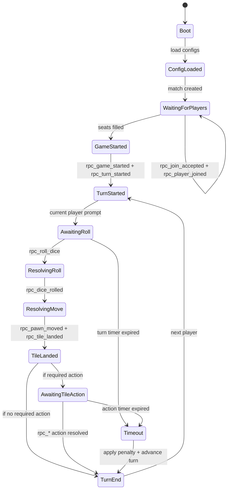

# Server State Machine (Headless)

This diagram is a high-level guide for prioritizing unit tests and RPCs. Each transition should map to at least one test.

Notes:
- "Required action" includes buy/skip, incident resolution, inspection decisions, etc.
- Timeout behavior and penalties should be defined in `godot2/DESIGN.md`.
