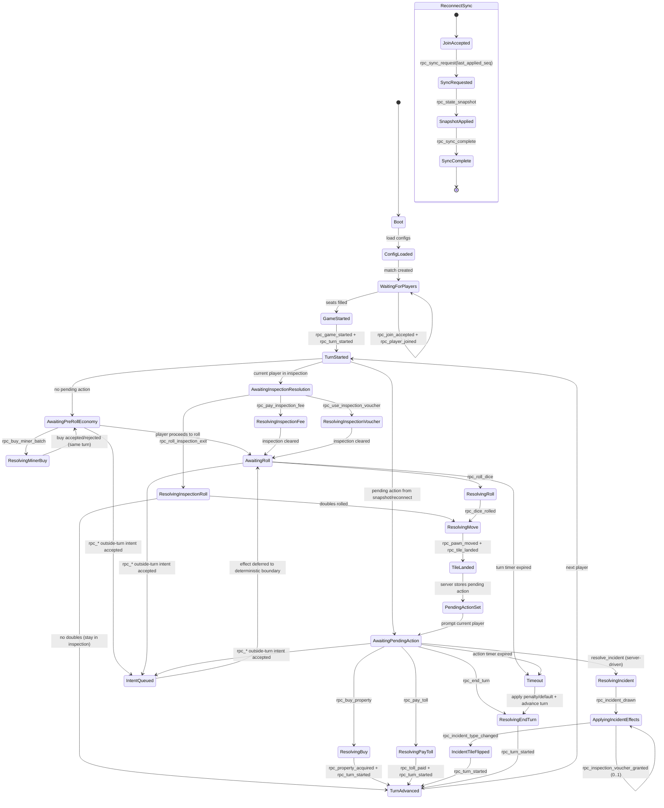

# Server State Machine (Headless)

This diagram is a high-level guide for prioritizing unit tests and RPCs. Each transition should map to at least one test.

```mermaid
stateDiagram-v2
    [*] --> Boot
    Boot --> ConfigLoaded: load configs
    ConfigLoaded --> WaitingForPlayers: match created
    WaitingForPlayers --> WaitingForPlayers: rpc_join (reject invalid)
    WaitingForPlayers --> WaitingForPlayers: rpc_join_accepted + rpc_player_joined
    WaitingForPlayers --> GameStarted: seats filled
    GameStarted --> TurnStarted: rpc_game_started + rpc_turn_started

    TurnStarted --> AwaitingPreRollEconomy: no pending action
    TurnStarted --> AwaitingInspectionResolution: current player in inspection
    TurnStarted --> AwaitingPendingAction: pending action from snapshot/reconnect
    AwaitingPreRollEconomy --> ResolvingMinerBuy: rpc_buy_miner_batch
    ResolvingMinerBuy --> AwaitingPreRollEconomy: buy accepted/rejected (same turn)
    AwaitingPreRollEconomy --> AwaitingRoll: player proceeds to roll
    AwaitingInspectionResolution --> ResolvingInspectionFee: rpc_pay_inspection_fee
    AwaitingInspectionResolution --> ResolvingInspectionVoucher: rpc_use_inspection_voucher
    AwaitingInspectionResolution --> ResolvingInspectionRoll: rpc_roll_inspection_exit
    ResolvingInspectionFee --> AwaitingRoll: inspection cleared
    ResolvingInspectionVoucher --> AwaitingRoll: inspection cleared
    ResolvingInspectionRoll --> ResolvingMove: doubles rolled
    ResolvingInspectionRoll --> TurnAdvanced: no doubles (stay in inspection)
    AwaitingRoll --> ResolvingRoll: rpc_roll_dice
    ResolvingRoll --> ResolvingMove: rpc_dice_rolled
    ResolvingMove --> TileLanded: rpc_pawn_moved + rpc_tile_landed
    TileLanded --> PendingActionSet: server stores pending action
    PendingActionSet --> AwaitingPendingAction: prompt current player
    AwaitingPendingAction --> ResolvingBuy: rpc_buy_property
    AwaitingPendingAction --> ResolvingPayToll: rpc_pay_toll
    AwaitingPendingAction --> ResolvingIncident: resolve_incident (server-driven)
    AwaitingPendingAction --> ResolvingEndTurn: rpc_end_turn
    ResolvingBuy --> TurnAdvanced: rpc_property_acquired + rpc_turn_started
    ResolvingPayToll --> TurnAdvanced: rpc_toll_paid + rpc_turn_started
    ResolvingIncident --> ApplyingIncidentEffects: rpc_incident_drawn
    ApplyingIncidentEffects --> ApplyingIncidentEffects: rpc_player_balance_changed (0..N)
    ApplyingIncidentEffects --> ApplyingIncidentEffects: rpc_player_sent_to_inspection (0..1)
    ApplyingIncidentEffects --> ApplyingIncidentEffects: rpc_inspection_voucher_granted (0..1)
    ApplyingIncidentEffects --> IncidentTileFlipped: rpc_incident_type_changed
    IncidentTileFlipped --> TurnAdvanced: rpc_turn_started
    ResolvingEndTurn --> TurnAdvanced: rpc_turn_started
    TurnAdvanced --> TurnStarted: next player

    AwaitingPreRollEconomy --> IntentQueued: rpc_* outside-turn intent accepted
    AwaitingRoll --> IntentQueued: rpc_* outside-turn intent accepted
    AwaitingPendingAction --> IntentQueued: rpc_* outside-turn intent accepted
    IntentQueued --> AwaitingRoll: effect deferred to deterministic boundary

    AwaitingRoll --> Timeout: turn timer expired
    AwaitingPendingAction --> Timeout: action timer expired
    Timeout --> ResolvingEndTurn: apply penalty/default + advance turn

    state ReconnectSync {
      [*] --> JoinAccepted
      JoinAccepted --> SyncRequested: rpc_sync_request(last_applied_seq)
      SyncRequested --> SnapshotApplied: rpc_state_snapshot
      SnapshotApplied --> SyncComplete: rpc_sync_complete
      SyncComplete --> [*]
    }
```

Notes:
- "Pending action" is authoritative server state and gates which action RPCs are valid.
- v0 action set is `buy_or_end_turn`, `pay_toll`, `resolve_incident`, and `end_turn`.
- Miner purchase (`rpc_buy_miner_batch`) is a pre-roll, current-turn economy action and is not represented as landing pending action.
- Inspection is a separate gate before roll for the current player; it is not modeled as a pending tile action.
- Inspection resolution can clear inspection and continue the same turn (`fee`, `voucher`, `doubles`) or consume the turn (`non-doubles`).
- Incident resolution is server-driven and may emit multiple mutation events before tile flip + turn advance.
- Outside-turn actions are recorded as deferred intents and never mutate the currently resolving turn.
- Deferred intents activate only at a deterministic boundary (`effective_from_turn` / equivalent rule).
- Timeout behavior and penalties should be defined in `godot2/DESIGN.md`.
